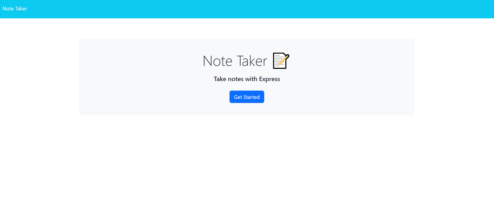
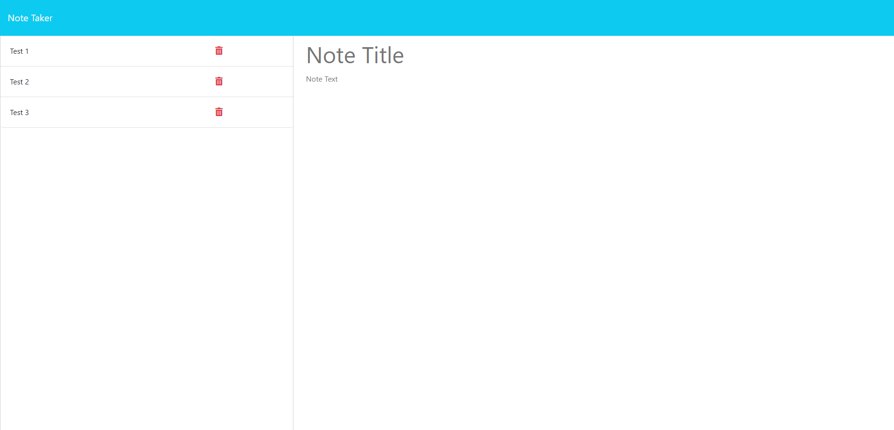

Title: 
Note-Taker

Description:
In this challenge, I have created an app to take notes online at the front end and tied to it a backend-server operations for specific routes using Express.
How to Run:
Please follow the URL below for the live website. You will be prompted with a "GET STARTED" button, then you will be taken to a notes page where you can type a title and the note itself. Once saved, you can view your note on the left hand column and go back to them by clicking on them or delete them with the trash icon next to the notes.

Github Repository : https://github.com/minikozort/Note-Taker
Render Deployed Link : https://note-taker-2plt.onrender.com

